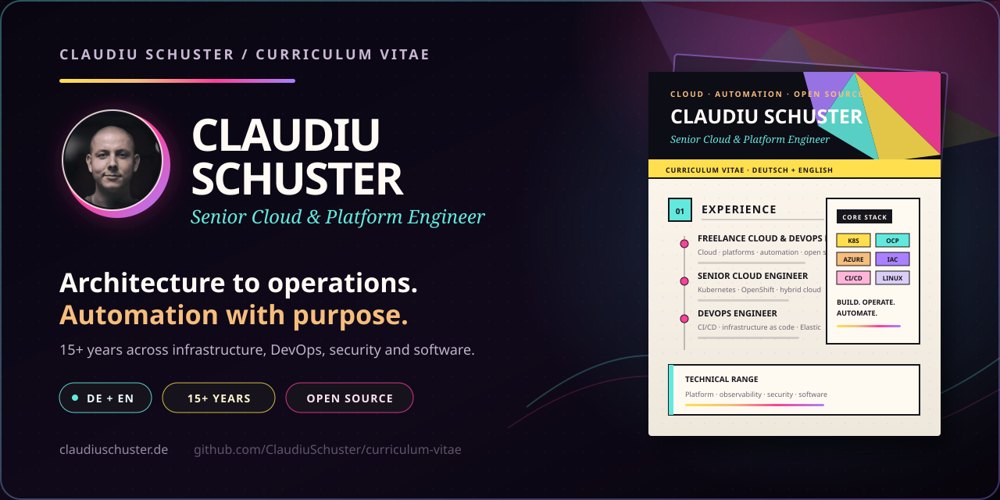

# Claudiu Schuster — CV

  
  <strong>•</strong>
  
  <strong>•</strong>
  

  

Bilingual, two-page A4 curriculum vitae with a shared visual identity.

  <a href="https://oss-oo.io/ClaudiuSchuster/curriculum-vitae/releases/latest"><strong>Download · Deutsch &amp; English (PDF)</strong></a>
  &nbsp;&nbsp;<strong>•</strong>&nbsp;&nbsp;
  <a href="https://oss-oo.io/ClaudiuSchuster/curriculum-vitae/releases">Version history</a>
  &nbsp;&nbsp;<strong>•</strong>&nbsp;&nbsp;
  <a href="docs/README.md">Development documentation</a>

